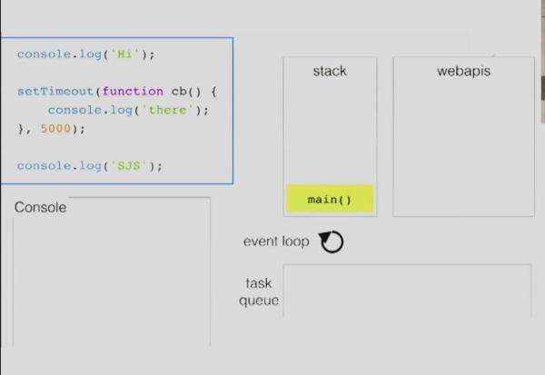
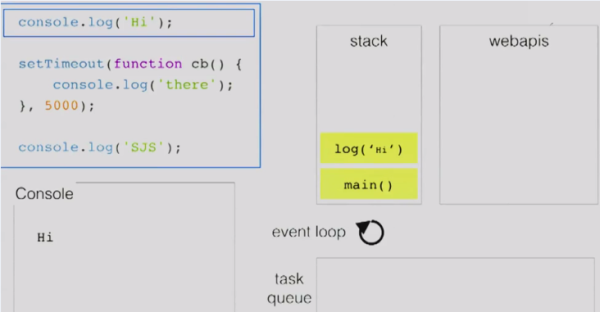
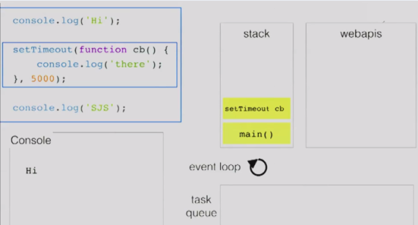
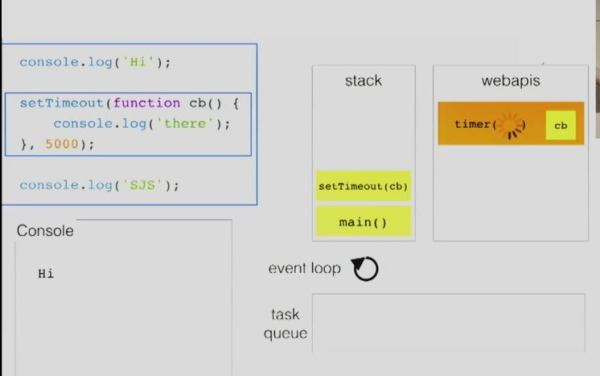
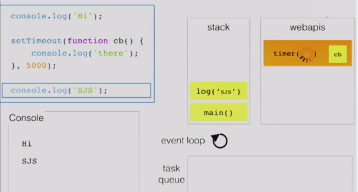
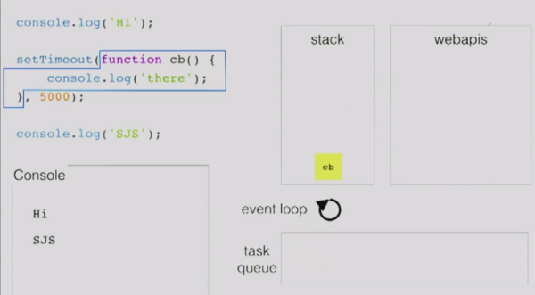
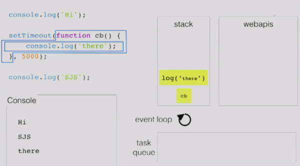

## 函数调用栈和任务队列
&emsp;&emsp;Javascript有一个**函数调用栈（call-stack）**，当在**函数调用栈**中执行某一个task时，其他的task都要等着，直到这个task执行完成并从**函数调用栈**中出栈（**函数调用栈**此时为空）时，下一个task才可以进入**函数调用栈**中执行。

&emsp;&emsp;而JavaScript是**单线程**的，当在执行过程中遇到一些类似于setTimeout等异步操作的时候，会交给浏览器的其他模块(以webkit为例，是webcore模块)进行处理，当到达setTimeout指定的延时执行的时间之后，task(回调函数)会放入到**任务队列**之中。不同的异步任务的回调函数会放入不同的**任务队列**之中，比如宏任务和微任务（如下所示）。两者中，前者为宏任务，后者为微任务，在事件循环中的执行顺序均为从左到右。

1.macro-task包括：script(整体代码), setTimeout, setInterval, setImmediate, I/O, UI rendering

2.micro-task包括：process.nextTick, Promises, Object.observe(已废弃), MutationObserver(html5新特性)

等到函数调用栈中所有task执行完毕之后，接着去执行其它任务队列之中的task。下图展示了大致的执行流程以及结构：

&emsp;&emsp;由上图可知，函数调用栈中遇到DOM操作/ajax请求或者setTimeout等WebAPIs的时候就会交给浏览器内核的其他模块进行处理，webkit内核在Javasctipt执行引擎之外，有一个重要的模块是webcore模块。对于图中WebAPIs提到的三种API，webcore分别提供了DOM Binding、network、timer模块来处理底层实现。等到这些模块处理完这些操作的时候将回调函数放入**任务队列**中，之后等栈中的task执行完之后再去执行以上**任务队列**之中的回调函数。
## 以setTimeout为例观察事件循环机制（借鉴别人的）
1.首先main()函数的执行上下文入栈。

2.代码接着执行，遇到console.log(‘Hi’),此时log(‘Hi’)入栈，console.log方法只是一个webkit内核支持的普通的方法，所以log(‘Hi’)方法立即被执行。此时输出’Hi’。

3.当遇到setTimeout的时候，执行引擎将其添加到栈中。

4.调用栈发现setTimeout是之前提到的WebAPIs中的API，因此将其出栈之后将延时执行的函数交给浏览器的timer模块进行处理。

5.timer模块去处理延时执行的函数，此时执行引擎接着执行将log(‘SJS’)添加到栈中，此时输出’SJS’。

6.当timer模块中延时方法规定的时间到了之后就将其放入到任务队列之中，此时调用栈中的task已经全部执行完毕。

7.任务队列中的回调函数调入函数调用栈中执行。

8.执行具体的内部程序。

## 总结
&emsp;&emsp;本文简单讲解了JavaScript事件循环机制的原理，主要几点如下：

&emsp;&emsp;1.所有的代码都要通过函数调用栈中调用执行。
&emsp;&emsp;2.当遇到前文中提到的APIs的时候，会交给浏览器内核的其他模块进行处理。
&emsp;&emsp;3.任务队列中存放的是回调函数。
&emsp;&emsp;4.等到调用栈中的task执行完之后再回去执行任务队列之中的task。

&emsp;&emsp;本文只能算是入门，若想深入了解JavaScript的事件循环机制，可见我的下一篇文章[JavaScript事件循环机制高级篇](http://www.whbxyr.cn/2017/04/09/EventLoopUp/)
## 参考资料
[深入浅出Javascript事件循环机制(上)](https://zhuanlan.zhihu.com/p/26229293)
[深入浅出JavaScript事件循环机制(下)](https://zhuanlan.zhihu.com/p/26238030)
[前端基础进阶（十二）：深入核心，详解事件循环机制](http://www.jianshu.com/p/12b9f73c5a4f)
[JavaScript：彻底理解同步、异步和事件循环(Event Loop)](https://segmentfault.com/a/1190000004322358)