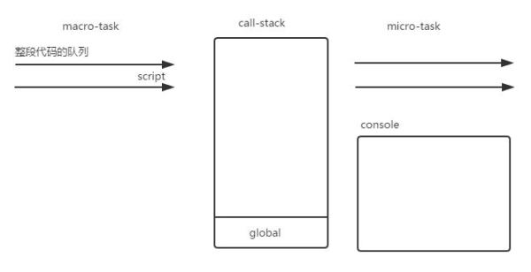
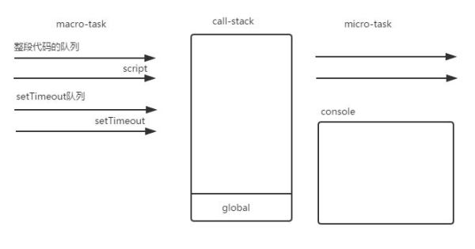
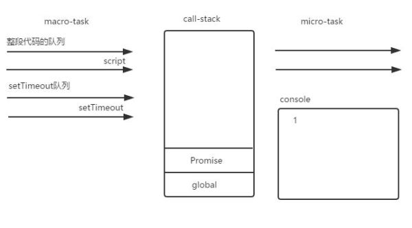
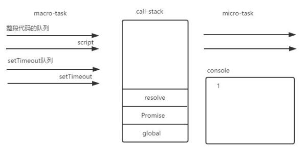
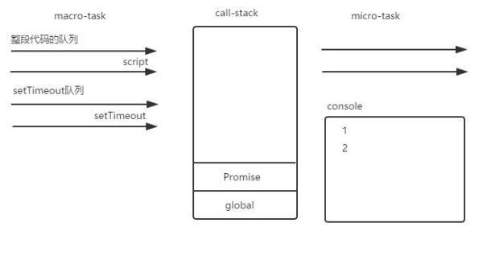
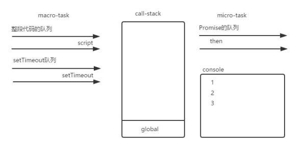
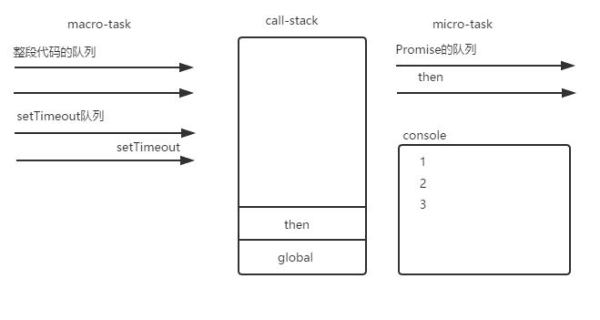
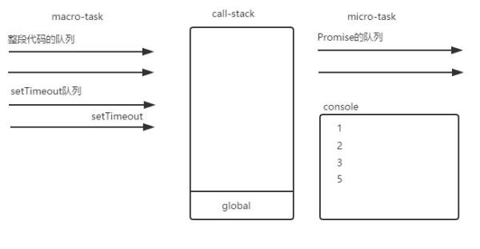
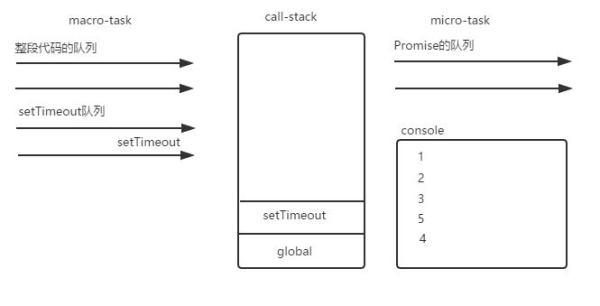

&emsp;&emsp;在上一篇文章[JavaScript事件循环机制入门篇](http://www.whbxyr.cn/2017/04/09/EventLoop/)当中，我们对JavaScript的事件循环机制进行了初步的了解，熟悉了JavaScript的函数调用栈以及任务队列的定义和作用，并指出JavaScript的任务队列分为**宏任务(macro-task)**和**微任务(micro-task)**两种，如下：

1.**macro-task**包括：script(整体代码), setTimeout, setInterval, setImmediate, I/O, UI rendering

2.**micro-task**包括：process.nextTick, Promises, Object.observe(已废弃), MutationObserver(html5新特性)

&emsp;&emsp;这篇文章里，我们就以一段测试代码来感受一下JavaScript事件循环机制的“复杂过程”。测试代码如下：（依然是借鉴的别人的例子）
```js
(function test() {
    setTimeout(function () {console.log(4)}, 0);
    new Promise(function executor(resolve) {
        console.log(1);
        for (var i = 0; i < 10000; i++) {
            i == 9999 && resolve();
        }
        console.log(2);
    }).then(function () {
        console.log(5);
    });
    console.log(3);
})();
```
1.首先，script任务源先执行，全局上下文入栈。

2.script任务源的代码在执行时遇到setTimeout,作为一个macro-task，将其回调函数放入自己的队列之中。

3.script任务源的代码在执行时遇到Promise实例。Promise构造函数中的第一个参数是在当前任务直接执行不会被放入队列之中，因此此时输出 1 。

4.在for循环里面遇到resolve函数，函数入栈执行之后出栈，此时Promise的状态变成Fulfilled。代码接着执行遇到console.log(2),输出2。


5.接着执行，代码遇到then方法，其回调函数作为micro-task入栈，进入Promise的任务队列之中。

6.代码接着执行，此时遇到console.log(3),输出3。

7.输出3之后第一个宏任务script的代码执行完毕，这时候开始开始执行所有在队列之中的micro-task。then的回调函数入栈执行完毕之后出栈，这时候输出5


8.这时候所有的micro-task执行完毕，第一轮循环结束。第二轮循环从setTimeout的任务队列开始，setTimeout的回调函数入栈执行完毕之后出栈，此时输出4。

## 总结
+ 任务分**宏任务**和**微任务**两种，它们（回调函数）被放入不同的任务队列中。

+ 对一段代码，先执行**宏任务**中的一个任务队列，等到这个任务队列中的函数从函数调用栈中**清空**时，再执行**微任务**。

+ 等到所有的**微任务**执行完毕后，再从**宏任务**中的一个任务队列开始执行。

+ JavaScript事件循环机制就是按照以上3步循环执行的。
## 提问？
&emsp;&emsp;如果在**宏任务**或者**微任务**里面再嵌套进去一个或者多个**宏任务**或者**微任务**，事件循环机制又是怎么处理的呢？比如以下测试代码的输出情况就有三种：
```js
console.log('glob1');
setImmediate(function () {
    console.log('immediate1');
    process.nextTick(function () {
        console.log('immediate1_nextTick');
    });
    new Promise(function (resolve) {
        console.log('immediate1_promise');
        resolve();
    }).then(function () {
        console.log('immediate1_then');
    });
    setTimeout(function () {
    	console.log('immediate1_timeout1');
    });
    setImmediate(function () {
    	console.log('immediate1_immediate1');
    });
});
setTimeout(function () {
    console.log('timeout1');
    process.nextTick(function () {
        console.log('timeout1_nextTick');
    });
    new Promise(function (resolve) {
        console.log('timeout1_promise');
        resolve();
    }).then(function () {
        console.log('timeout1_then');
    });
    setTimeout(function () {
    	console.log('timeout1_timeout1');
	    process.nextTick(function () {
	        console.log('timeout1_timeout1_nextTick');
	    });
	    setImmediate(function () {
	    	console.log('timeout1_setImmediate1');
	    });
    });
});
new Promise(function (resolve) {
    console.log('glob1_promise');
    resolve();
}).then(function () {
    console.log('glob1_then');
});
process.nextTick(function () {
    console.log('glob1_nextTick');
});
```
#### 第一种输出情况：
```
glob1
glob1_promise
glob1_nextTick
glob1_then
timeout1
timeout1_promise
timeout1_nextTick
timeout1_then
immediate1
immediate1_promise
immediate1_nextTick
immediate1_then
timeout1_timeout1
timeout1_timeout1_nextTick
immediate1_immediate1
timeout1_setImmediate1
immediate1_timeout1
```
#### 第二种输出情况：
```
glob1
glob1_promise
glob1_nextTick
glob1_then
timeout1
timeout1_promise
timeout1_nextTick
timeout1_then
immediate1
immediate1_promise
immediate1_nextTick
immediate1_then
immediate1_immediate1
timeout1_timeout1
immediate1_timeout1
timeout1_timeout1_nextTick
timeout1_setImmediate1
```
#### 第三种输出情况：
```
glob1
glob1_promise
glob1_nextTick
glob1_then
timeout1
timeout1_promise
timeout1_nextTick
timeout1_then
immediate1
immediate1_promise
immediate1_nextTick
immediate1_then
timeout1_timeout1
immediate1_timeout1
timeout1_timeout1_nextTick
immediate1_immediate1
timeout1_setImmediate1
```
本人还不是特别理解这些情况，如果您了解的话，请不吝赐教！我的工作邮箱：**raywhbxyr@163.com**
## 参考资料
[深入浅出Javascript事件循环机制(上)](https://zhuanlan.zhihu.com/p/26229293)
[深入浅出JavaScript事件循环机制(下)](https://zhuanlan.zhihu.com/p/26238030)
[前端基础进阶（十二）：深入核心，详解事件循环机制](http://www.jianshu.com/p/12b9f73c5a4f)
[JavaScript：彻底理解同步、异步和事件循环(Event Loop)](https://segmentfault.com/a/1190000004322358)