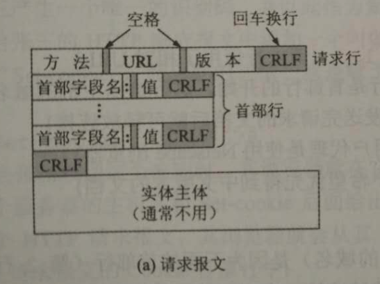
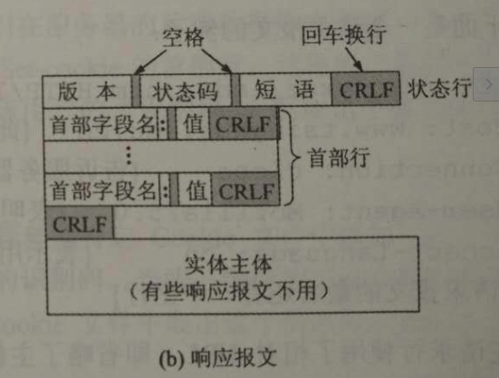

&emsp;&emsp;HTTP 协议定义了浏览器（万维网客户端）怎样向万维网服务器请求万维网文档，以及服务器怎样把文档传送给浏览器。从层次的角度看，HTTP 协议是面向事务的应用层协议，它是万维网上能够可靠地交换文件（包括文本/声音/图像等各种多媒体文件）的重要基础。

## (一) http协议的特点
+ http是**面向事务**/**无状态**/**无连接**的协议
+ http报文分请求报文和响应报文两种
+ http的发展路线：0.9 ~ 1.0 ～ 1.1 ～ 2.0

## (二) http报文的分类
#### http报文分两类，包括`请求报文`以及`响应报文`，两种报文的格式都由三部分组成，包括`开始行`/`首部行`/`实体主体` 三部分。

（1）**请求报文** 即浏览器（万维网客户端）向万维网服务器发送的报文。请求报文中的开始行也称作 `请求行`，首部行又叫做请求报文的 `请求头`，实体主体（请求主体）又叫做 `http实体`（包含首部行和实体主体两部分）的实体主体。各部分的详细格式信息如下图：

&emsp;&emsp;例子：

&emsp;&emsp;GET /562f25980001b1b106000338.jpg HTTP/1.1
&emsp;&emsp;Host    img.mukewang.com
&emsp;&emsp;User-Agent    Mozilla/5.0 (Windows NT 10.0; WOW64) AppleWebKit/537.36 (KHTML, like Gecko) Chrome/51.0.2704.106 Safari/537.36
&emsp;&emsp;Accept    image/webp,image/*,*/*;q=0.8
&emsp;&emsp;Referer    http://www.imooc.com/
&emsp;&emsp;Accept-Encoding    gzip, deflate, sdch
&emsp;&emsp;Accept-Language    zh-CN,zh;q=0.8

（2）**响应报文** 即万维网服务器向浏览器（万维网客户端）发送的报文。响应报文中的开始行也称作`状态行`，首部行又叫做请求报文的 `响应头`，实体主体（响应主体）又叫做 `http实体`（包含首部行和实体主体两部分）的实体主体。各部分的详细格式信息如下图：

&emsp;&emsp;例子：

&emsp;&emsp;HTTP/1.1 200 OK
&emsp;&emsp;Date: Fri, 22 May 2009 06:07:21 GMT
&emsp;&emsp;Content-Type: text/html; charset=UTF-8
&emsp;&emsp;
&emsp;&emsp;`<html>`
&emsp;&emsp;`      <head></head>`
&emsp;&emsp;`      <body>`
&emsp;&emsp;`            <!--body goes here-->`
&emsp;&emsp;`      </body>`
&emsp;&emsp;`</html>`

## (三) http报文的状态码（响应报文产生的）
http响应报文产生的状态码主要分五类，如下：
（1）1xx，表示通知信息的，如请求收到了或正在进行处理。包括 **100 - 102** 。
（2）2xx，表示成功，如接受或知道了。包括 **200 - 207** 。
（3）3xx，表示重定向，如要完成请求还必须采取进一步的行动。包括 **300 - 307** 。
（4）4xx，表示客户的差错，如请求中有错误的语法或不能完成。包括 **400 - 418** 、**421 - 426**、**449**、**451**。
（5）5xx，表示服务器的差错，如服务器失效无法完成请求。包括 **500 - 507**、**509 - 510**。
其中，还有一个比较少见的状态码 **600**，它代表万维网服务器只返回了响应主体而没有返回响应头。
## (四) http协议中的相关称谓
+ **请求头**/**响应头**（header），即**首部行**。
+ **http实体**，即由**首部行**（header）以及**实体主体**（body）两部分组成的，不包括开始行。