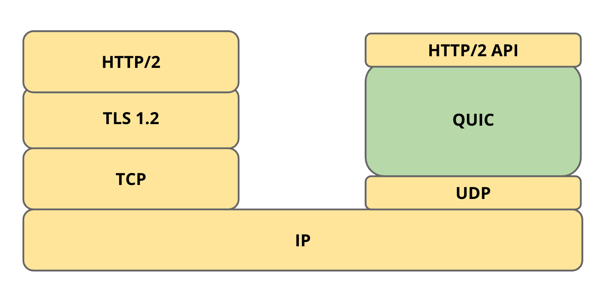
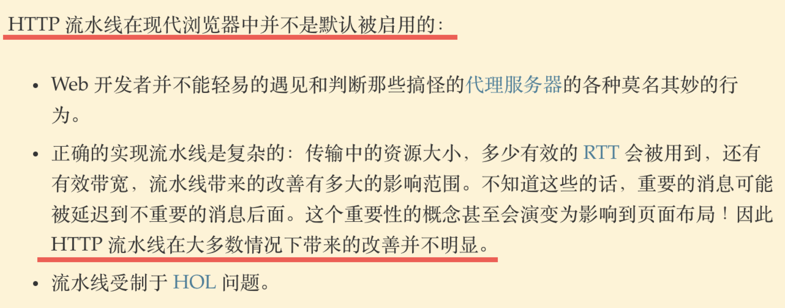
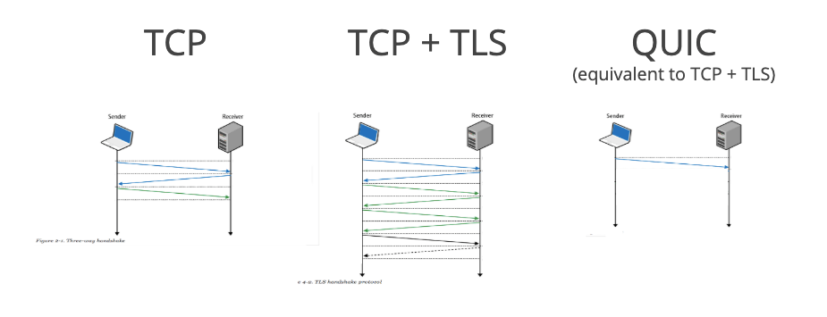
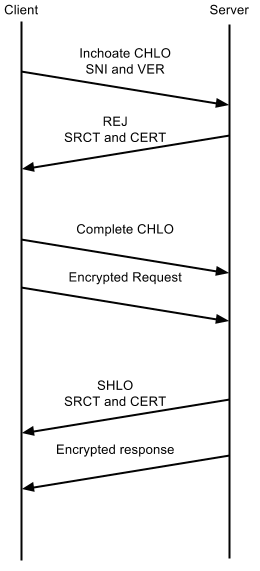
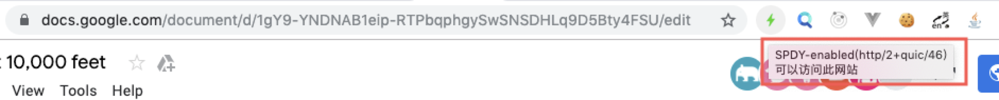
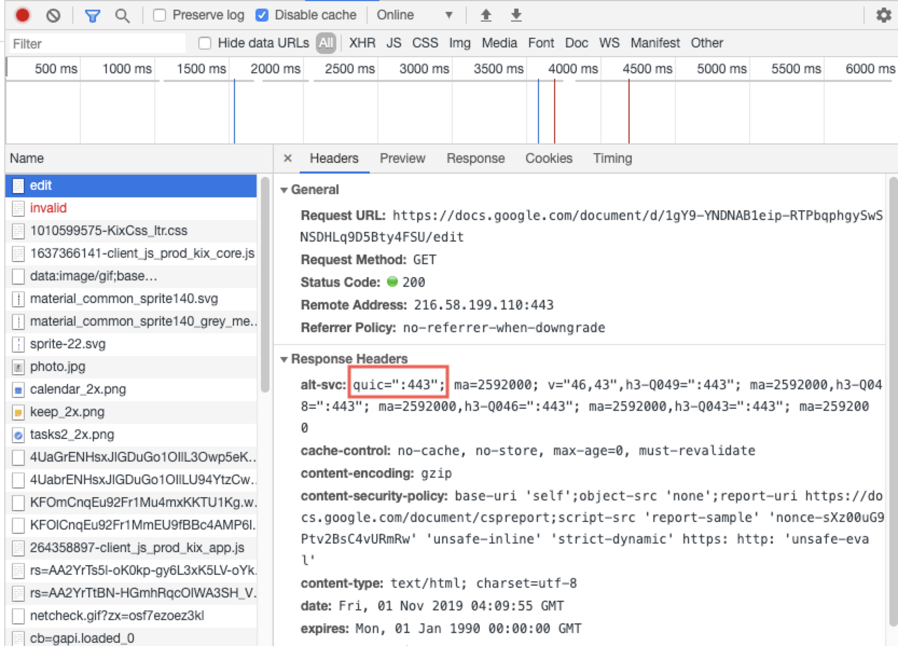

&emsp;&emsp;HTTP（HyperText Transfer Protocol）是万维网（World Wide Web）的基础协议。自 Tim Berners-Lee 博士和他的团队在 1989 - 1991 年间创造出它以来，HTTP 已经发生了太多的变化，在保持协议简单性的同时，不断扩展其灵活性，如今也发展到 HTTP/3 了，而 HTTP/3 规范的底层则是基于 IETF 创建并标准化的传输层协议 QUIC。



<div style="color:#000;text-align:center;background: #ff0;">TCP + TLS + HTTP/2 == UDP + QUIC + HTTP/2 API</div>

## <font color="#f00">HTTP 各版本回顾</font>

### HTTP/0.9
1. 没有严格的版本号，HTTP/1.0 之前的统称为 HTTP/0.9
2. 没有 HTTP headers 概念
3. 只支持 GET 请求
4. 返回数据只支持 HTML 文本文件

### HTTP/1.0
1. 狭义上，跟 HTTP/0.9 一样不是标准官方版本，是在 HTTP/0.9 的基础上进行扩展
2. 添加了状态码、request headers、response headers
3. 支持除 html 外的其他文档类型
4. 默认为短连接，通过配置 connection 可以支持持久连接

### HTTP/1.1
1. HTTP 的第一个正式标准化版本
2. 默认为持久连接，有线头阻塞问题，一般浏览器通过对同一个域名同时开启多个持久连接来缓解，比如 chrome 是默认 6 个

3. 支持 pipelining，一般浏览器默认关闭此功能，因为有很多实现上的问题


### HTTP/2
1. 二进制协议而不是文本协议
2. 多路复用，缓解线头阻塞问题（丢包情况下还是会有问题）
3. 压缩了 headers
4. 服务器主动推送


## <font color="#f00">HTTP/3 - QUIC</font>

### 几个概念性解释
1. QUIC 早期由 Google 开发，是 Chromium 项目组内的一个开源项目，那时有人叫它 gQUIC，后来谷歌以 QUIC 名称提交给 IETF 后，又有人叫它 iQUIC，但实际上这两个名字都是非官方的，以后只统称 QUIC。
2. IETF 于 2018 年 10 月正式将基于 QUIC 协议的 HTTP (英语：HTTP over QUIC) 重命名为 HTTP/3，即 HTTP/3 是一个规范，意指传输层使用 QUIC 协议的 HTTP 协议。
3. IETF 规范的 QUIC 协议是严格意义上的传输层协议，不止能应用于 HTTP，其他的应用层协议比如 DNS、SSH 等理论上也是可以使用 QUIC 的。
4. 目前国内 QUIC 的使用比例还是比较少的，一方面是部分通信厂商屏蔽了 UDP 端口，另一方面是很多服务器（Nginx / Apache）还没能很好地支持 QUIC。

### QUIC 特性详解
1. 降低延迟
2. 更灵活的拥塞控制
3. 强化版的二进制多路复用
4. 前向纠错
5. 更快的网络恢复速度

#### <font color="#ff0">降低延迟</font>
&emsp;&emsp;通过减少建立连接所需的 RTT 个数以此降低延迟，通过比较就可以看出来差别。

&emsp;&emsp;可以看出，在 QUIC 下，建立 HTTP 连接只需要 1RTT 就可以了，在这个 RTT 之后就可以开始加密和发送数据了。下图展示的则是完整的握手过程。
<div align="center">
  
</div>

#### <font color="#ff0">更灵活的拥塞控制</font>
&emsp;&emsp;QUIC 虽然是基于 UDP 实现的，但是也建立在 TCP 数十年的经验基础上，很多实现方面吸纳了 TCP 的最佳实践，QUIC 的拥塞控制算法就是在 TCP 的拥塞控制算法 Cubic 上进行重写的，它向拥塞控制算法提供了更多的信息，比如原始跟重传的每一个数据包都携带一个新的序列号，这样，QUIC 发送方就可以将重传的 ACK 与原始的 ACK 区别开来，并且避免了 TCP 的重传歧义问题，这样可以进行精确的往返时间 RTT 计算。 

#### <font color="#ff0">强化版的二进制多路复用</font>
&emsp;&emsp;为了缓解线头阻塞问题，HTTP/2 采用了二进制分帧的方式实现了时间上的复用，即在同一时间可以在一条 TCP 线路上同时进行多个请求的发送和响应接收，但是当出现丢包的时候，HTTP/2 的多路复用方式还是会出现线头阻塞问题，体现在当某个流出现丢包时，当前流跟其他流都会堵塞，整个 TCP 接收窗口就会卡住直到该丢失的包重新补上来。而 QUIC 中的某个流发生数据包帧丢失时，只会影响该流本身的数据组装，其他没有发生丢包的数据流，则可以继续接收并组装数据，实现了 HTTP/2 多路复用的强化版。

#### <font color="#ff0">前向纠错</font>
&emsp;&emsp;前向纠错即 Forward Error Correction，简称 FEC。QUIC 支持使用前向纠错的方式实现在不重传的情况下也能恢复丢失了的数据包，核心就是通过多发送一些冗余的数据包（FEC 包），当非冗余的数据包丢失时，通过 FEC 包重新计算得出丢失的包数据。
```
let
E = XOR(A, B, C, D)
then 
-A = XOR(B, C, D, E)
-B = XOR(A, C, D, E)
-C = XOR(A, B, D, E)
-D = XOR(A, B, C, E)
```
&emsp;&emsp;如上所示，A、B、C、D 是四个数据包，E 是一个 FEC 包，当 A、B、C、D 中任意一个丢失的时候，都可以通过冗余包 E 来做计算恢复，这样就免去了发送端进行重传后再进行重组的步骤。

#### <font color="#ff0">更快的网络恢复速度</font>
&emsp;&emsp;每一个 QUIC 连接由客户端随机生成的 64 位唯一连接 ID 标识，TCP 连接则是由 4 个元组的源地址、源端口、目标地址和目标端口标识，这意味着如果客户端更改 IP 地址（例如，通过移出 Wi-Fi范围并切换到蜂窝网络）或端口（如果 NAT 盒丢失并重新绑定了新的端口），则任何已经建立的 TCP 连接都要作废，必须通过发起新的 TCP 连接以建立连接。但是当 QUIC 客户端更改 IP 地址时，通过原本生成的唯一标识，它可以完全复用原有的连接，实现 0RTT 建立连接，直观表现来看，结果就是切换网络之后恢复连接的速度加快了，具体效果可以观看 [切换网络后提速效果视频](https://drive.google.com/file/d/1DlMI_3MOxnWarvEVfzKxFqmD7c-u1cYG/view)。

## <font color="#f00">怎样检测 QUIC</font>
&emsp;&emsp;使用 chrome 浏览器（有些浏览器没有 QUIC 实现）并安装插件 [HTTP/2 and SPDY indicator](https://chrome.google.com/webstore/detail/http2-and-spdy-indicator/mpbpobfflnpcgagjijhmgnchggcjblin)，当页面使用了 QUIC 的时候闪电图标会变成绿色。



&emsp;&emsp;打开控制台观察下 Network 部分，确实看到了 QUIC 相关的信息。



## <font color="#f00">怎样把网站升级到 QUIC</font>
&emsp;&emsp;QUIC 在 UDP 基础上由客户端自由发挥，只要有服务器能对接就可以，比较遗憾的是现在主流的代理服务 Nginx/Apache 都没有实现 QUIC，一些比较小众的代理服务如 Caddy 就实现了。具体的实现方式可以参考文章 [怎样把网站升级到 QUIC 及 QUIC 特性分析 - 李银城](https://zhuanlan.zhihu.com/p/37919534)。

## <font color="#f00">QUIC 降级方案</font>
&emsp;&emsp;当发生以下情况导致 QUIC 无法正常使用的时候，连接协议会自动降级为普通的 HTTP/TCP。
1. UDP 被屏蔽
2. 客户端禁止了 QUIC 的使用（访问 chrome://flags/#enable-quic 进行禁止或开启）
3. path MTU 过小

## <font color="#f00">总结</font>
&emsp;&emsp;QUIC 特性总结：
1. 可靠的多路传输
2. 通过 UDP 运行
3. 始终加密
4. 更低的连接建立延迟
5. 可选的前向纠错 FEC
6. 灵活性强发展空间大
7. 开源

## <font color="#f00">参考文献</font>
[Evolution of HTTP](https://developer.mozilla.org/en-US/docs/Web/HTTP/Basics_of_HTTP/Evolution_of_HTTP)
[QUIC, a multiplexed stream transport over UDP - The Chromium Projects](https://www.chromium.org/quic)
[IETF93 QUIC BarBoF: Protocol Overview](https://docs.google.com/presentation/d/15e1bLKYeN56GL1oTJSF9OZiUsI-rcxisLo9dEyDkWQs/edit#slide=id.g99041b54d_0_0)
[怎样把网站升级到 QUIC 及 QUIC 特性分析 - 李银城](https://zhuanlan.zhihu.com/p/37919534)
