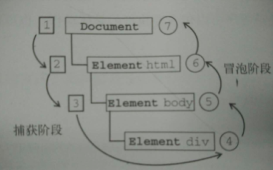

&emsp;&emsp;`事件流`描述的是从页面中接收事件的顺序，而 IE 和 Netscape 提出了差不多是完全相反的事件流的概念。IE 的事件流是`事件冒泡`，而 Netscape Communicator 的事件流是`事件捕获`。
### <font style="color: #0ff;">IE的事件冒泡</font>
&emsp;&emsp;事件冒泡，即事件开始时由最具体的元素（文档中嵌套层次最深的那个节点）接收，然后逐级向上传播到较为不具体的节点（文档）。以下面的页面为例：
```html
<!DOCTYPE html>
<html>
<head>
    <title>Event Bubbling Example</title>
</head>
<body>
    <div id="myDiv">Click Me</div>
</body>
</html>
```
&emsp;&emsp;如果你单击了页面中的`<div>`元素，那么这个click事件会按照如下顺序传播：
(1) `<div>`
(2) `<body>`
(3) `<html>`
(4) `document`
&emsp;&emsp;IE5.5 及更早的版本中的事件冒泡会跳过`<html>`元素（从`<body>`直接跳到document）。IE9、Firefox、Chrome 和 Safari 则将事件一直冒泡到 window 对象。

### <font style="color: #0ff;">事件捕获</font>
&emsp;&emsp;事件捕获的思想是不太具体的节点应该更早接收到事件，而最具体的节点应该最后接收到事件。事件捕获的用意在于在事件达到预定目标之前捕获它。如果仍以前面的HTML页面作为例子，那么单击`<div>`元素就会以下列顺序触发 click 事件：
(1) `document`
(2) `<html>`
(3) `<body>`
(4) `<div>`
&emsp;&emsp;虽然事件捕获是 Netscape Communicator 唯一支持的事件流模型，但 IE9、Safari、Chrome、Opera 和 Firefox 目前也都支持这种事件流模型。尽管“DOM2级事件”规范要求事件应该从 document 对象开始传播，但这些浏览器都是从 window 对象开始捕获事件的。

## 由于老版本的浏览器不支持，因此很少有人使用事件捕获，建议使用事件冒泡，在有特殊需要的时候再使用事件捕获。

### <font style="color: #0ff;;">DOM 事件流</font>
&emsp;&emsp;“DOM2级事件”规定的事件流包括三个阶段：事件捕获阶段、处于目标阶段和事件冒泡阶段。它们的发生顺序如下：
(1) 事件捕获，为截获事件提供了机会，这一过程不会传播到实际的事件目标
(2) 实际的目标接收到事件，于是事件在此目标上发生，并在事件处理中被看成冒泡阶段的一部分
(3) 冒泡阶段，可以在这个阶段对事件做出响应，然后事件又传播回文档。
&emsp;&emsp;仍以前面的HTML页面作为例子，DOM2级事件流如下图：


### <font style="color: #f00;">事件处理程序：</font>

&emsp;&emsp;事件处理程序分**HTML事件处理程序**、**DOM0级事件处理程序**、**DOM2级事件处理程序**、**IE事件处理程序**四种。为了兼容各种浏览器，也催生出了**跨浏览器的事件处理程序**。
#### <font style="color: #f0f;">HTML事件处理程序</font> 
&emsp;&emsp;示例如下：
```html
<script>
function showMsg() {
    alert('Hello world!');
}
</script>
<input type="button" value="Click Me" onclick="showMsg()">
```

#### <font style="color: #f0f;">DOM0级事件处理程序</font> 
&emsp;&emsp;示例如下：
```javascript
var btn = document.getElementById('myBtn');
btn.onclick = function () {
    // 弹出“myBtn”
    alert(this.id);
}
```

#### <font style="color: #f0f;">DOM2级事件处理程序</font> 
&emsp;&emsp;示例如下：
```javascript
var btn = document.getElementById('myBtn');
var handler = function () {
    alert(this.id);
};
btn.addEventListener('click', handler, false);
// 指定事件处理程序的名称才能实现移除事件处理程序
btn.removeEventListener('click', handler, false);
```

#### <font style="color: #f0f;">IE事件处理程序</font> 
&emsp;&emsp;示例如下：
```javascript
var btn = document.getElementById('myBtn');
var handler = function () {
    alert(‘Clicked’);
};
btn.attachEvent('onclick', handler);
// 指定事件处理程序的名称才能实现移除事件处理程序
btn.detachEvent('onclick', handler);
```

#### <font style="color: #f0f;">跨浏览器的事件处理程序</font> 
&emsp;&emsp;既然事件处理程序在不同浏览器上的实现方式不一样，那么能够跨浏览器的事件处理程序的存在就十分重要。关于跨浏览器的事件处理程序，可以观看我的另一篇文章——[兼容浏览器的事件处理程序 EventUtil](http://www.whbxyr.cn/2016/06/24/EventUtil/)！

### <font style="color: #f00;">总结</font>
在使用事件时，需要考虑如下一些内存与性能方面的问题。
1.有必要限制一个页面中事件处理程序的数量，数量太多会导致占用大量内存，而且也会让用户感觉页面反应不够灵敏。
2.建立在事件冒泡机制之上的事件委托技术，可以有效地减少事件处理程序的数量。
3.建议在浏览器卸载页面之前移除页面中的所有事件处理程序。