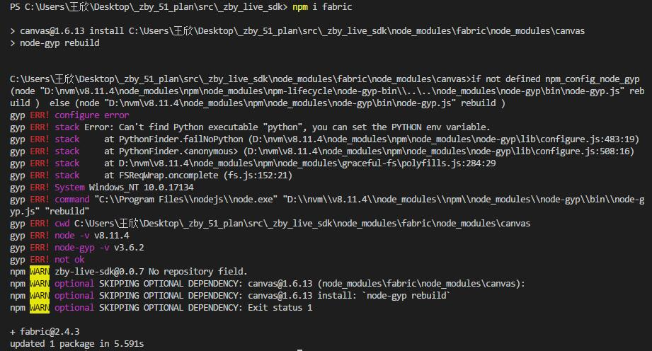
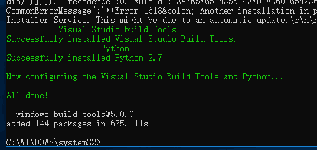

&emsp;&emsp;在 windows 上执行 npm 安装但凡涉及到 canvas，比如我最近就在使用一个 canvas 库 Fabric，就经常会报 gyp ERR。所以我的解决思路是查找安装 canvas 失败的解决方法，只要解决了 canvas 安装失败的问题，就可以解决 gyp ERR。

## 解决步骤
&emsp;&emsp;（1）npm i -g node-gyp

&emsp;&emsp;（2）npm install --global --production windows-build-tools
&emsp;&emsp;注意：需要在有管理员权限的命令终端中执行。

&emsp;&emsp;（3）下载 [GTK2](http://ftp.gnome.org/pub/GNOME/binaries/win64/gtk+/2.22/gtk+-bundle_2.22.1-20101229_win64.zip)，将下载下来的 zip 包解压到 C:\GTK。

&emsp;&emsp;（4）这时候 npm install canvas 就可以正常安装不报 gyp ERR 了。
## 注意事项
&emsp;&emsp;如果系统用户名是中文，还是会导致 npm 安装 canvas 报错，需要修改系统用户名为英文，方法参考文章 [Win10 用户文件夹改名](https://www.sohu.com/a/127599728_116178)，修改完成后再重新按照上面的步骤安装就行。
