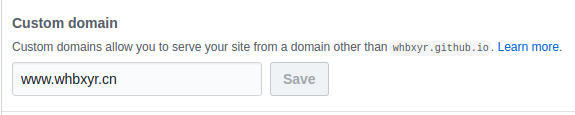
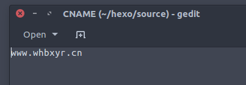

#### 一共需要两个步骤：
1.添加一条CNAME记录，主机记录随便写（根据个人需要，比如www，url便为www.域名.根域名），记录值为你的github page的地址，比如我的就是[whbxyr.github.io](https://whbxyr.github.io/)。如下图：

2.在你放置hexo博客的github仓库的Settings里设置Custom domain，设置为你要的url，比如我的就是[www.whbxyr.cn](http://www.whbxyr.cn/)，如下图：

  或者在你的本地hexo博客目录下的source文件夹里添加一个文件，文件名为CNAME，在其中输入你的域名，比如我的就是[www.whbxyr.cn](http://www.whbxyr.cn/)，如下图：

