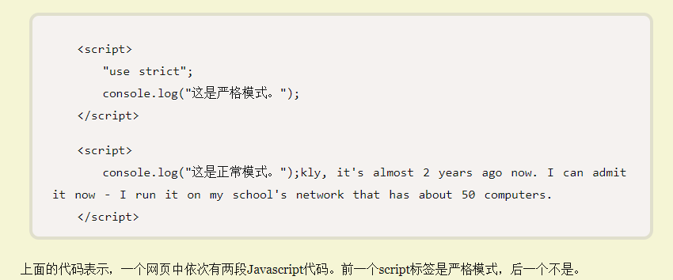

&emsp;&emsp;ECMAScript 5 定义了严格模式，可以使 JavaScript 更清晰，减少不安全的功能，并提供更多的警告和有逻辑的行为。同时也是为了提高编译器效率，增加运行速度，为未来新版本的 Javascript 做好铺垫。
## (一) 切换到严格模式的方法：
&emsp;&emsp;（1）在 JavaScript 文件顶部或者 script 元素的顶部键入 ‘use strict’。
&emsp;&emsp;注意：不支持 ECMAScript 5 严格模式的 JavaScript 引擎将自动忽略 ‘use strict’，不产生任何效果。可以做到前一个 script 是严格模式而后一个不是，如下：

&emsp;&emsp;（2）在函数 function 顶部键入 ‘use strict’。

&emsp;&emsp;（3）ECMAScript 2015 引入了 JavaScript 模块，这种模块内的全部内容自动处于严格模式，无需语句 ‘use strict’ 即可启动它。
## (二) 使用严格模式的注意事项：
&emsp;&emsp;（1）历史代码可能依赖于不再可用的功能或者依赖于在草率模式下生效的功能，在这种代码中草率切换到严格模式可能会导致代码无法执行。但是你可以将新建的严格模式函数放到草率模式的文件中，避免产生冲突。

&emsp;&emsp;（2）打包代码、压缩代码的时候，如果混合了严格模式跟草率模式的代码，可能会破坏代码。
## (三)严格模式相比草率模式有什么不同：
&emsp;&emsp;（1）所有变量都必须有相应的声明，不能对未声明的变量执行任何操作。
&emsp;&emsp;注意：草率模式下，给未声明的变量赋值就是给全局变量赋值。

&emsp;&emsp;（2）不能给属于基本数据类型的表达式或原始值设置属性。
&emsp;&emsp;例子：false.true = ''; (14).sailing = 'home'; 'with'.you = 'far away'; 这些都会报错 TypeError。
&emsp;&emsp;注意：草率模式下静默失败，无任何作用。

&emsp;&emsp;（3）函数必须声明在作用域顶级（全局作用域或者函数的顶级作用域）。
&emsp;&emsp;注意：草率模式下，函数可以在任何地方声明；严格模式下，若想在块级作用域内声明函数，只能通过将匿名函数赋值给变量的方法。

&emsp;&emsp;（4）函数接收的参数名不能重复，对象不能含有重复的属性。
&emsp;&emsp;注意：草率模式下，对于函数，重复的参数值依然可以在 arguments 对象中访问到，但是实际的参数值会被后一个重复的参数值覆盖，对于对象，最后一个重复属性的值会覆盖前面的重复属性的值。

&emsp;&emsp;（5）不能给 arguments 重新赋值，arguments 对象的 caller 属性和 callee 属性均被废除，且 arguments 内参数值的变化不再跟具体的函数参数变化有关联，即改变 arguments[0] 的值不会影响第一个函数参数的值，改变了第一个函数参数的值也不会导致 arguments[0] 的值发生改变。
&emsp;&emsp;注意：草率模式下，arguments 记录的参数值跟实际的参数值是互相追踪关联的。

&emsp;&emsp;（6）不能给 eval 重新赋值，eval 执行时拥有自己的内部作用域，这是除了全局作用域、函数作用域、块级作用域外的第四种作用域，例如执行 var x = 2; eval('var x = 5;'); 时，第一个 x 的值将依然是 2。

&emsp;&emsp;（7）不能使用 fn.caller 和 fn.arguments 获取函数调用的堆栈，使用了会报错。

&emsp;&emsp;（8）在函数中，未对 this 赋值的话 this 就是 undefined。
&emsp;&emsp;注意：严格模式下如果你忘了使用 new 来调用构造函数，就会报不能对 undefined 赋值的错。

&emsp;&emsp;（9）不能设置和删除不可变属性，不能对 undefined 、NaN 等不可写变量赋值，不能对只有 getter 却没有 setter 的属性赋值，不能扩展不可扩展的对象的属性。
&emsp;&emsp;注意：草率模式下只会静默失败。

&emsp;&emsp;（10）不能删除变量，只有 configurable 设置为 true 的对象属性，才能被删除。
&emsp;&emsp;注意：var x = 12; delete x; 会报错，草率模式下只会静默失败。

&emsp;&emsp;（11）with 语句被废弃了，再也不能使用 with 为对象绑定属性。

&emsp;&emsp;（12）不能使用前缀 0 表示八进制数，否则报错。在 ECMAScript 2015 中要使用 0o 作为前缀表示八进制数。

&emsp;&emsp;（13）严格模式增加了保留字（比如 protected、implements、interface、private、static 等等）。

