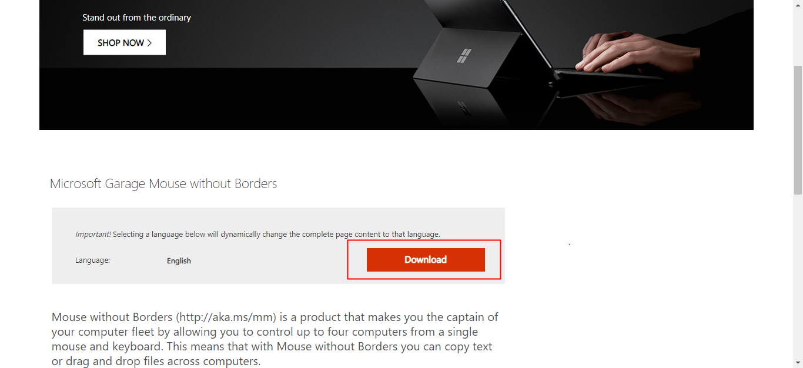
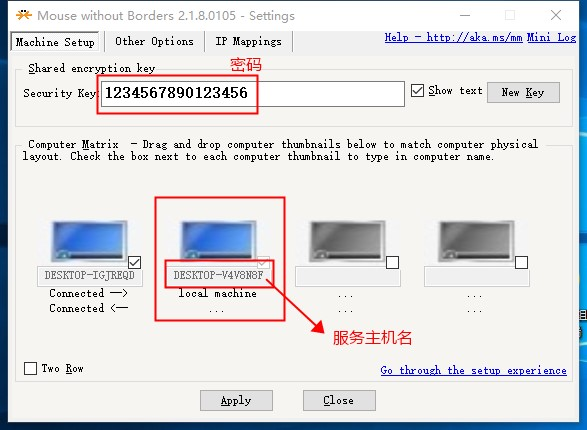
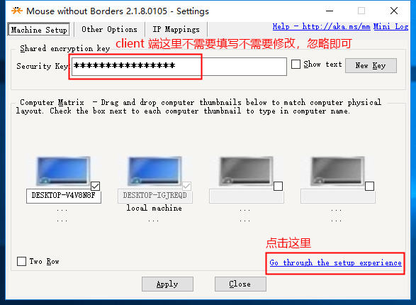
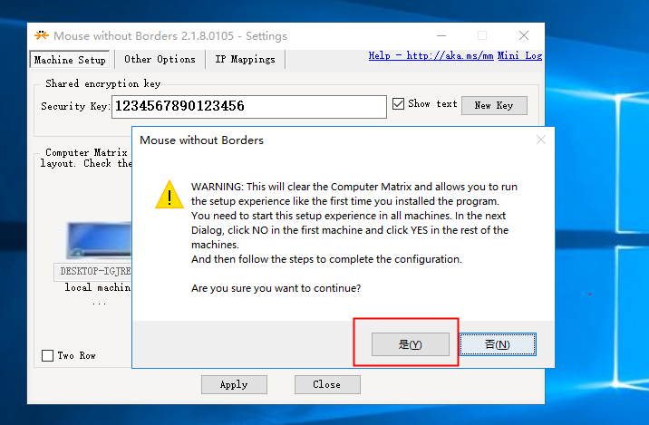
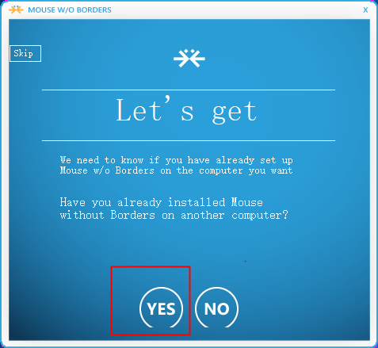
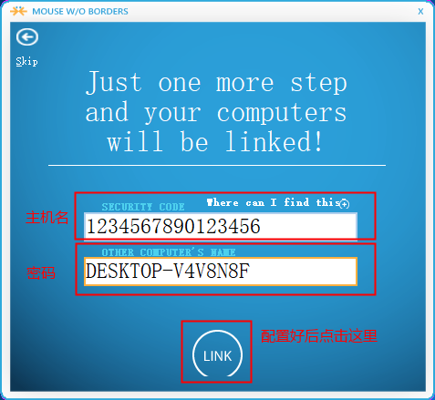
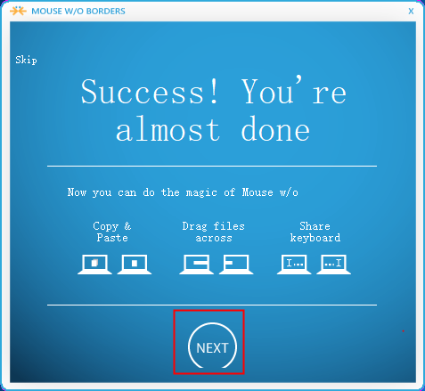
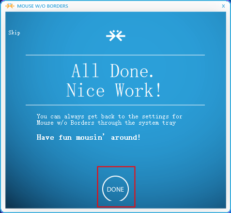

&emsp;&emsp;对于某些特定场景，比如音视频通话，开发调试的时候需要由两台 PC 之间进行交互。这种场景调试起来是十分费劲的，一方面文件没办法共享，另一方面操作界面是分开的，鼠标做不到共享，你不得不在两个鼠标之间来回切换。而本文介绍的利器 Mouse without Borders 就可以完美地解决这个问题。

## 下载安装
&emsp;&emsp;下载安装包请戳 [Mouse without Borders](https://www.microsoft.com/en-us/download/details.aspx?id=35460)，下载完成后在你需要调试的两台 PC 上都安装上这个软件。

## 配置
&emsp;&emsp;**注意**：在配置之前请一定确保你的两台 PC 机处于同一个网段（局域网）下，比如都连接上了同一个 wifi。

&emsp;&emsp;两台 PC 机一台充当 server 端，提供服务主机名和密码，另一台充当 client 端，用来连接 server 端（需要服务主机名和密码）。

&emsp;&emsp;client 端连接 server 端也很简单，按照以下图示步骤即可，核心是将前面的服务主机名以及密码填入即可。
#### 第一步

#### 第二步

#### 第三步

#### 第四步
&emsp;&emsp;这里填入的服务主机名以及密码便是 server 端提供的。

#### 第五步

#### 第六步

&emsp;&emsp;现在你就可以尽情地玩耍了，不仅可以用一个鼠标在两个 PC 之间进行无缝操作，还可以将文件从一台 PC 拖动（复制黏贴）到另一台 PC 上。