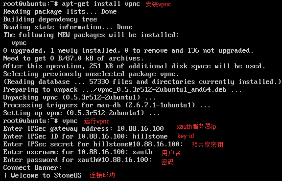
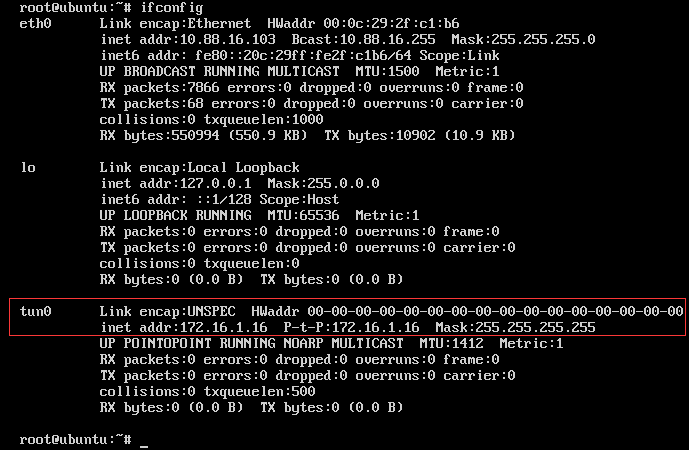
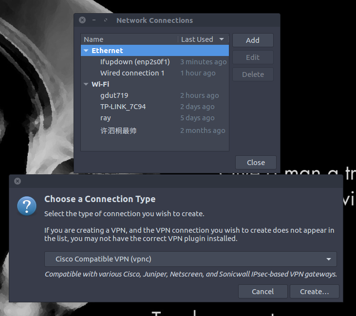
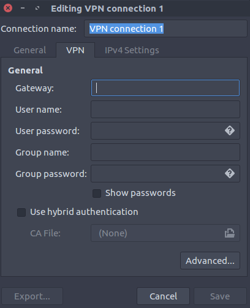

## （一） 命令行安装并使用 Cisco VPN
#### 1. 连接 Cisco VPN
&emsp;&emsp;切换到root后安装vpnc并设置各项参数
```bash
// 切换到root
$ su
// 安装vpnc
# apt-get install vpnc
// 使用vpnc命令并设置参数
# vpnc
// 之后按照提示输入各项设置，可见下图
```


#### 2. 查看 Cisco VPN
```bash
// 使用命令 ifconfig 查看 Cisco VPN 连接情况
# ifconfig
```


#### 3. 断开 Cisco VPN
```bash
// 使用命令 vpnc-disconnect 断开 Cisco VPN
# vpnc-disconnect
```

## （二）图形界面配置 Cisco VPN（需要先安装）
#### 第一步： 命令行安装图形化的 Cisco VPN
```
$ sudo apt-get install network-manager-vpnc network-manager-vpnc-gnome
```

#### 第二步： 打开Network Connections 并选择 Cisco Compatible VPN(vpnc)，如下图


#### 第三步： 点击 Create... 后进行配置，配置的参数包括 Gateway(网关)，User name(用户名)，User password(喻户密码)，Group name(组名称)，Group password(组密码)，配置完成后点击 Save 保存设置。如下图：


#### 第三步： 点击 VPN Connections 并选择刚刚设置的 Cisco VPN（比如 VPN connection 1），若能看到以下标志，则说明成功链接 Cisco VPN
