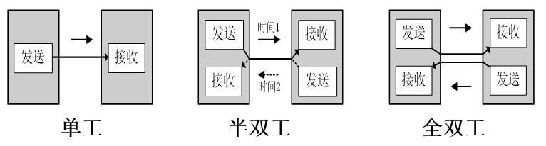
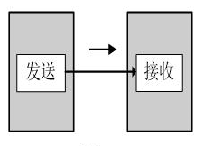
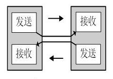
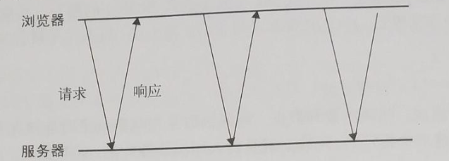
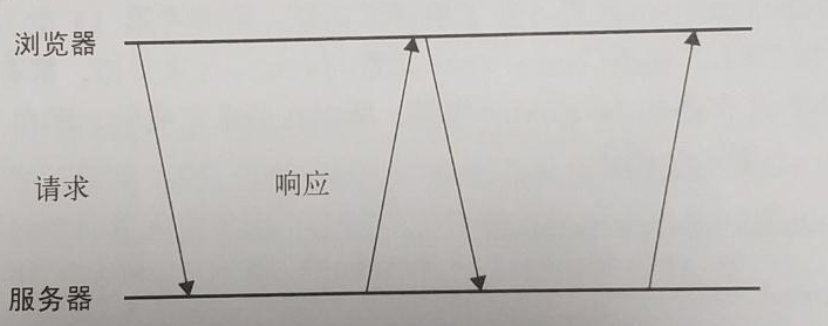

&emsp;&emsp;随着互联网的迅速发展，单工以及半双工的通信方式已经无法满足日益复杂的业务需求了，对全双工通信的依赖越来越重。而 WebSocket 协议便是全双工通信协议中的一个典型代表。

## 单工、半双工、全双工
&emsp;&emsp;数据通信中，数据在线路上的传送方式可以分为单工通信、半双工通信和全双工通信三种。

### 单工
&emsp;&emsp;所谓单工通信，是指消息只能单方向传输的工作方式。它的信道是单向信道，发送端跟接收端都是固定的，数据只能从发送端向接收端流动。例如遥控、遥测，就是单工通信方式。

### 半双工
&emsp;&emsp;以半双工数通信方式工作的数据传输，数据可以在一个信号载体的两个方向上传输，但是不能同时传输。比如 http 协议就是基于半双工的方式工作的。

### 全双工
&emsp;&emsp;全双工通信允许数据同时在两个方向上进行传输，也就是说任一一端在同一时间内既可以是数据接收端也可以是数据发送端。

### 全双工通信（服务器推送）的模拟
&emsp;&emsp;在全双工通信未成熟的年代主要通过短轮询、长轮询以及流这三种方式来模拟。

##### （一）短轮询
&emsp;&emsp;客户端通过 Ajax 的方式，每隔一小段时间就发送一个请求到服务器，服务器返回最新数据。

&emsp;&emsp;**优点**：逻辑简单，实现起来容易
&emsp;&emsp;**缺点**：服务器压力较大，浪费带宽流量（通常数据并没有立马发生变化）

##### （二）长轮询
&emsp;&emsp;客户端发送一个请求到服务器，服务器查看需要的数据是否发生了变化，如果有变化就立即响应返回数据，否则保持这个连接并定期检查最新数据直到发生了数据更新或者连接超时。

&emsp;&emsp;**优点**：逻辑简单，实现起来容易
&emsp;&emsp;**缺点**：服务器压力较大，浪费带宽流量（通常数据并没有立马发生变化）

##### （三）流
&emsp;&emsp;浏览器向服务器发送一个请求，而服务器保持连接打开，然后周期性地向浏览器发送数据。
&emsp;&emsp;**优点**：只发送一次请求，然后服务端保持与客户端的长连接
&emsp;&emsp;**缺点**：依赖于 XHR 对象的 readyState 属性，部分浏览器（IE）不支持，需要使用不同的技术进行兼容

## WebSocket 介绍

### 诞生背景
&emsp;&emsp;随着 web 的发展，需要使用到全双工通信的场景越来越多，使用全双工通信的需求也越来越大。前面介绍的模拟实现的方式，其实都是利用浏览器单向请求服务器或者服务器单向推送数据到浏览器这些技术来做 hack 的，为了避免 hack 的不便性以及加强 web 的功能，全双工通信协议 WebSocket 诞生了。

### 兼容性
&emsp;&emsp;目前流行的浏览器对 WebSocket 的支持都是很友好的。生产环境使用 WebSocket 是很常见的。

### 浏览器端的实现
&emsp;&emsp;详细可参考 MDN 文档 [WebSocket](https://developer.mozilla.org/en-US/docs/Web/API/WebSocket)。

### 服务端的实现
&emsp;&emsp;很多服务端框架实现了对 WebSocket 的支持，常用的 Node 实现有以下三种。
+ [µWebSockets](https://github.com/uNetworking/uWebSockets)
+ [Socket.IO](https://socket.io)
+ [WebSocket-Node](https://github.com/theturtle32/WebSocket-Node)

&emsp;&emsp;本人使用 WebSocket-Node 实现了一个简易类 IM 系统。移步 [GitHub](https://github.com/whbxyr/IM)。

## WebSocket 使用场景
+ **即时通讯 IM**：包括社交聊天、弹幕等等
+ **服务端推送**：天气预报实时更新、股票基金实时报价等等
+ **信道服务**：在线教育、在线直播等场景下依赖的信道

## 总结
&emsp;&emsp;WebSocket 是基于 TCP 长连接的网络协议，它与 http 一样属于应用层协议，但是它与其他应用层协议的不同点在于它在建立连接后，通信双方都可以在任何时刻向另一方发送数据。

